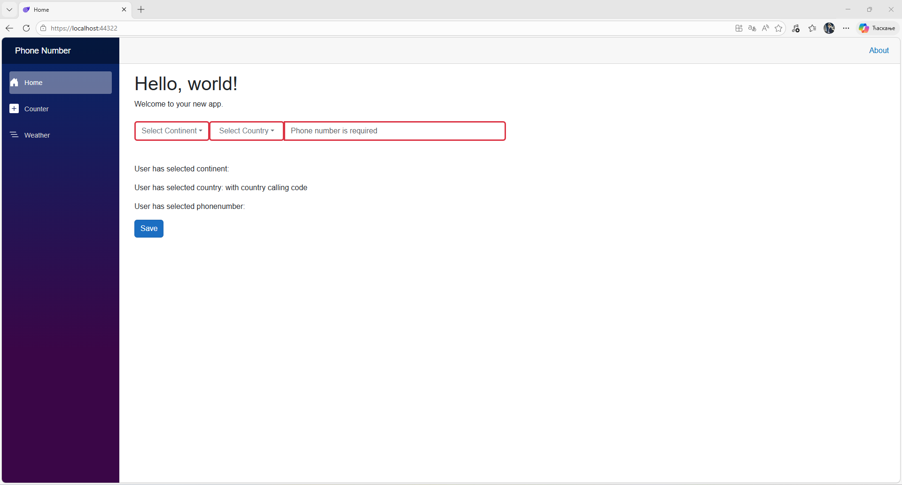
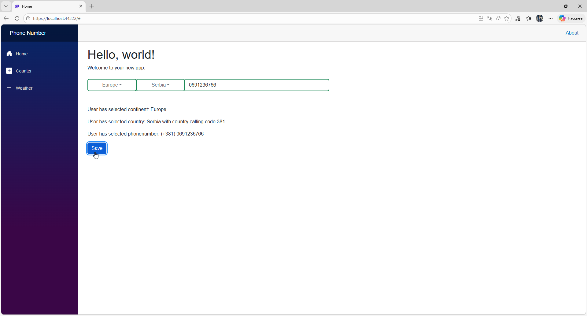
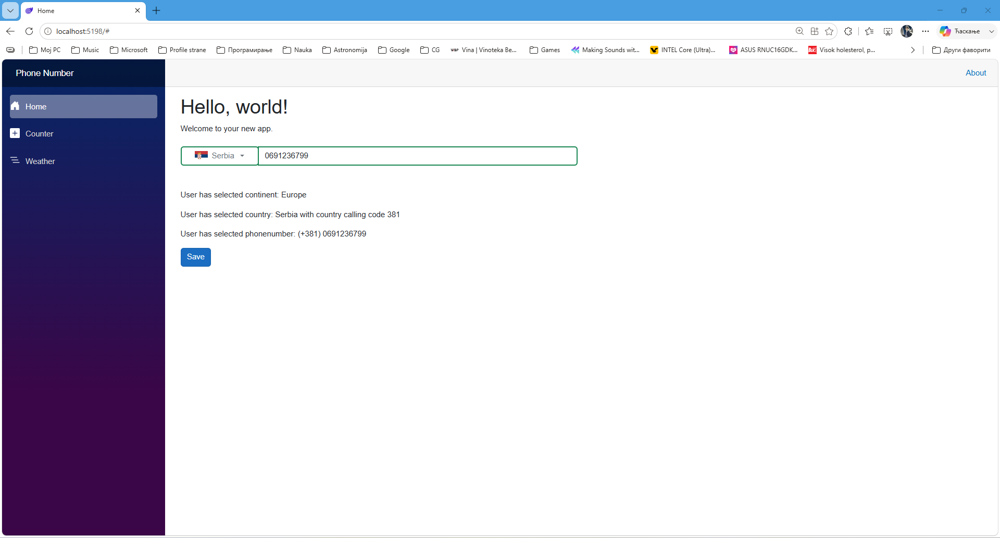

# Blazor Custom Input Phone Number Component

This library provides a **reusable Blazor component** for phone number input. 
The component integrates logic for continent and country selection, 
automatic filtering of the country list, and visual validation, 
making data entry simpler and more intuitive for end users.

## 🚀 Key Features
* **Dynamic Filtering:** Automatically updates the list of available countries based on the selected continent.
* **Two-Way Data Binding:** Full support for `@bind` syntax for phone numbers, countries, and continents.
* **Customizable Validation:** Visual feedback through styled input borders based on the `required` status.
* **Modularity:** Option to include or exclude dropdown menus via component parameters.
* **Modern UI:** Built on the Bootstrap 5 framework for a responsive and consistent look.
* **Local SVG Flags Integration:** Built-in high-quality local SVG flag support with customizable aspect ratios (`1x1` square and `4x3` rectangular formats).

## 🛠️ Installation and API Reference

To use the component, add a reference to the `PhoneNumberComponentLibrary` and ensure Bootstrap 5 CSS/JS is loaded in your application.


### Usage Example
```
<PhoneNumberInput 
    @bind-PhoneNumber="userPhone" 
    @bind-SelectedCountry="userCountry"
    IncludeContinentSelect="true"
    IsRequired="true"
    ShowFlags="true" 
    FlagFormat="FlagFormatEnum.Rectangle4x3"/>
```





### Component Parameters
The component supports the following configuration parameters:

* **IncludeContinentSelect** (bool, default: true): Shows or hides the continent dropdown.
* **IncludeCountrySelect** (bool, default: true): Shows or hides the country dropdown.
* **IsRequired** (bool?, default: false): Enables visual validation by applying red/green borders based on input state.
* **Placeholder** (string, default: "Enter phone number"): Custom text displayed when the input is empty.
* **AutoComplete** (string, default: "off"): Sets the standard HTML autocomplete attribute.
* **ShowFlags** (bool, default: true): Enables or disables the rendering of country flags in the dropdown and selection buttons.
* **FlagFormat** (FlagFormatEnum, default: FlagFormatEnum.Rectangle4x3): Specifies the aspect ratio for the displayed flags.
* **FlagWidth** (string, default: "20px"): Custom CSS width for the rendered flag image.
* **FlagHeight** (string, default: "15px"): Custom CSS height for the rendered flag image.
* **ContinentMinWidth** (string, default: "4rem"): Minimum CSS width constraint for the continent dropdown button.
* **ContinentMaxWidth** (string?, default: null): Maximum CSS width constraint for the continent dropdown button.
* **CountryMinWidth** (string, default: "4rem"): Minimum CSS width constraint for the country dropdown button.
* **CountryMaxWidth** (string?, default: null): Maximum CSS width constraint for the country dropdown button.
* **InputMinWidth** (string?, default: null): Minimum CSS width constraint for the phone number input field.
* **InputMaxWidth** (string?, default: null): Maximum CSS width constraint for the phone number input field.
* **CustomContainerClass** (string?, default: null): Custom CSS classes for the main wrapper container element.
* **CustomContinentButtonClass** (string?, default: null): Custom CSS classes for the continent selection dropdown button.
* **CustomCountryButtonClass** (string?, default: null): Custom CSS classes for the country selection dropdown button.
* **CustomInputClass** (string?, default: null): Custom CSS classes for the phone number text input field.
* **CustomDropdownMenuClass** (string?, default: null): Custom CSS classes for the dropdown menus.

### 📂 Project Structure
* **/PhoneNumberComponentLibrary**: Source code for the component, models, enum definitions, and local static assets (wwwroot/flags).
* **/PhoneNumberComponentTestApp**: Blazor application for testing and demonstrating the component functionality.

### 📄 License
This project is licensed under the [CC0-1.0 license (Public Domain)](LICENSE.txt). Feel free to use, modify, and distribute the code without any restrictions.

## 📧 Contact

If you have any questions, encounter issues, or need assistance with the component, 
feel free to reach out via email: **[periczeljkosmederevo@yahoo.com](mailto:periczeljkosmederevo@yahoo.com)**.
